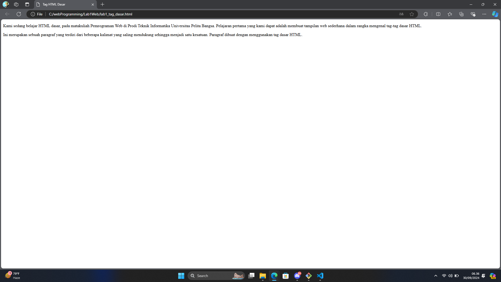
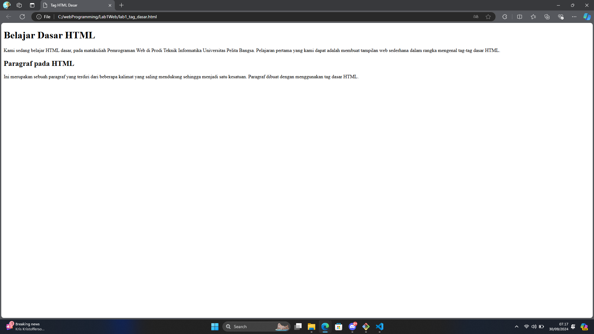
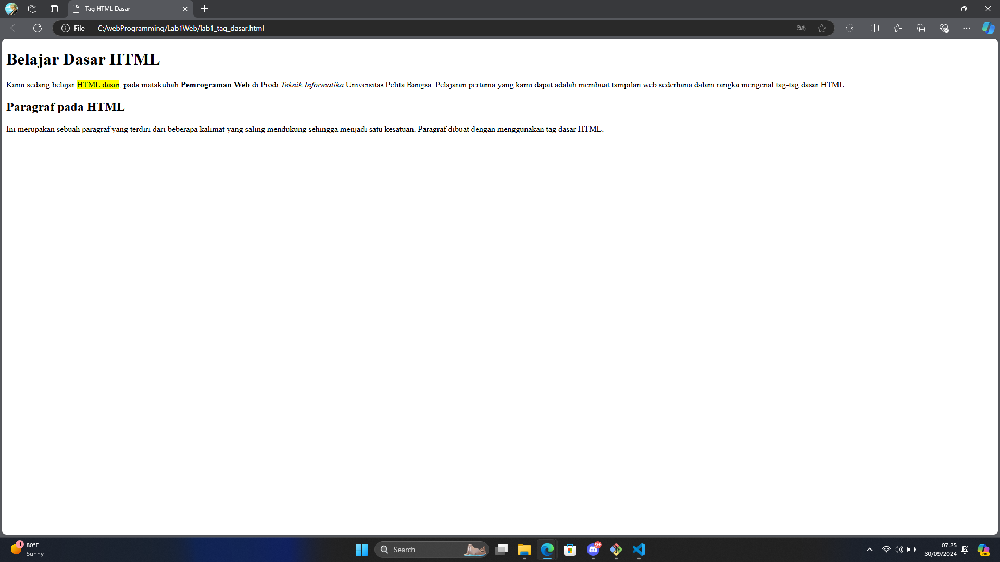
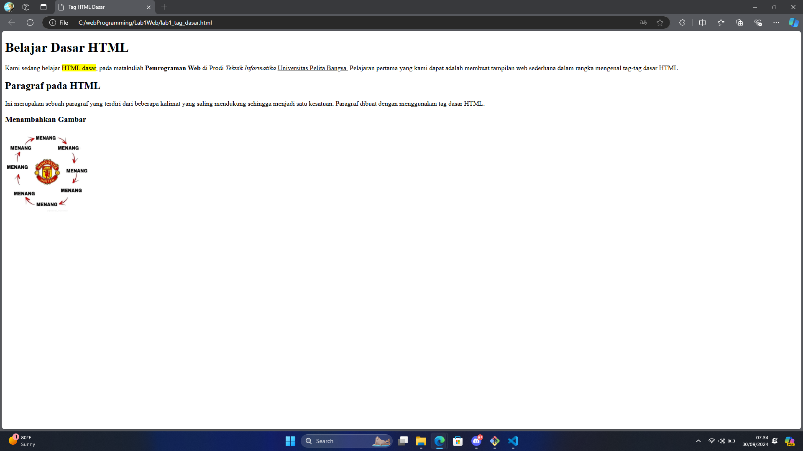
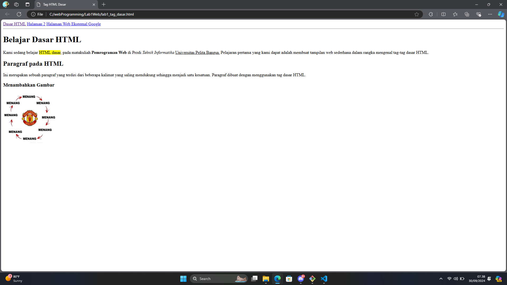

# Lab1Web
## Belajar Tag Dasar HTML

### Membuat paragraf
untuk membuat paragraf kita bisa menggunakan tag `
`
ini adalah tampilannya:

### Membuat judul
untuk judul kita bisa memakai tag `<h>`
ini adalah tampilannya:

### Memformat teks
untuk memformat teks seperti di gambar kita bisa memakai `<b>` untuk mempertebal, `<i>` untuk memiringkan, `<mark>` untuk memberikan tanda
ini adalah tampilannya:

### Menyisipkan gambar
untuk menambahkan gambar kita bisa memakai tag ``
ini adalah tampilannya:

### Menambahkan hyperlink
dan untuk menambahkan link kita bisa menggunakan tag `<a>`
ini adalah gambarnya:

### Jawaban
1. Ada

2. Berikut perbedaan antara tag `
` dan tag ` ` dalam HTML:

   Tag `
`:

   - Digunakan untuk membuat paragraf teks.
   - Menambahkan spasi di atas dan di bawah konten.
   - Merupakan elemen blok (block-level element).
   - Biasanya digunakan untuk mengelompokkan beberapa kalimat.

   Tag ` `:

   - Digunakan untuk membuat pemisah baris (line break).
   - Hanya memindahkan teks ke baris baru tanpa menambahkan spasi ekstra.
   - Merupakan elemen sebaris (inline element).
   - Biasanya digunakan untuk memisahkan baris dalam puisi atau alamat.

3. Atribut title dan alt pada tag `` memiliki fungsi yang berbeda dalam HTML. Berikut penjelasan tentang perbedaan keduanya:

   Atribut alt (Alternative Text):

   - Fungsi utama: Menyediakan teks alternatif untuk gambar.
   - Digunakan oleh pembaca layar untuk membantu pengguna dengan gangguan penglihatan.
   - Ditampilkan jika gambar gagal dimuat.
   - Penting untuk SEO (Search Engine Optimization).
   - Wajib ada menurut standar aksesibilitas web.

   Atribut title:

   - Fungsi utama: Memberikan informasi tambahan tentang gambar.
   - Ditampilkan sebagai tooltip saat kursor mouse diarahkan ke gambar.
   - Bersifat opsional dan tidak wajib ada.
   - Tidak mempengaruhi SEO secara signifikan.
   - Dapat digunakan untuk memberikan konteks tambahan atau deskripsi lebih lanjut.

4. Untuk mengatur ukuran gambar secara proporsional, sebaiknya Anda hanya mengisi salah satu dari atribut width atau height, tidak keduanya. Berikut penjelasannya:

   Mengisi hanya satu atribut (width atau height):

   - Ini adalah cara terbaik untuk menjaga proporsi gambar.
   - Browser akan menghitung dimensi lainnya secara otomatis berdasarkan rasio aspek asli gambar.

   Mengisi kedua atribut (width dan height):

   - Bisa menyebabkan distorsi gambar jika rasio yang digunakan berbeda dari rasio asli gambar.
   - Berguna dalam situasi tertentu, seperti ketika Anda perlu memaksa gambar ke dalam ukuran spesifik tanpa memperhatikan proporsi aslinya.

   Tidak mengisi kedua atribut:

   - Gambar akan ditampilkan dalam ukuran aslinya.
   - Bisa menyebabkan masalah layout jika ukuran gambar terlalu besar.

5. Atribut target pada tag `<a>` (link) menentukan di mana halaman yang ditautkan akan dibuka. Berikut penjelasan tentang apa yang terjadi untuk masing-masing nilai atribut target:

   _blank:

   - Membuka tautan dalam tab atau jendela browser baru.
   - Halaman saat ini tetap terbuka di tab/jendela aslinya.

   _self:

   - Ini adalah nilai default jika atribut target tidak ditentukan.
   - Membuka tautan di jendela/tab yang sama di mana tautan diklik.
   - Menggantikan halaman saat ini.

   _top:

   - Membuka tautan di jendela/tab penuh, menggantikan semua frame jika ada.
   - Jika tidak ada frame, berperilaku seperti _self.
   - Berguna dalam kasus di mana halaman Anda berada dalam frame atau iframe.

   _parent:

   - Membuka tautan di frame induk.
   - Jika tidak ada frame induk, berperilaku seperti _self.
   - Berguna dalam struktur halaman yang menggunakan frame atau iframe.